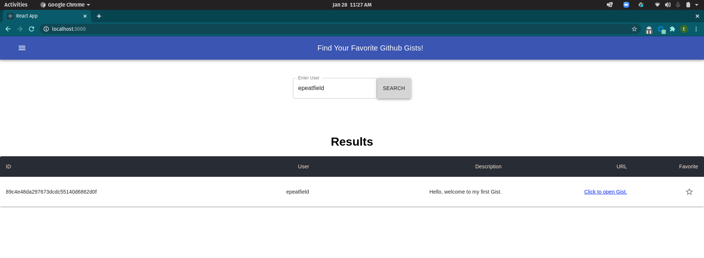
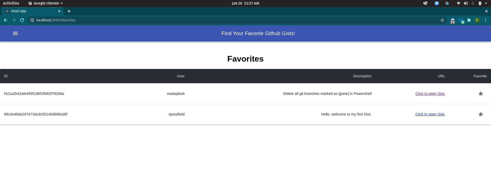

# Github Gists Favorites!

### Set Up:
1. Clone the repo:
    `git clone https://github.com/epeatfield/EmmaGithubGists.git`

2. Install the requirements:
    `npm install`

3. Start application: 
    `npm start`

4. Open up [http://localhost:3000](http://localhost:3000) in browser.

Once opened up, you will see a search bar. Enter a username and hit submit.

You can favorite any result that you like, and the favorites for that specific user will show above the results.
To see all favorites, you can click on the menu button in the top left corner and select Favorites.
This page will show all of the favorites that have been stored locally.

### Extra capabilities:
1. Test the application:`npm test`
- These tests are focused on snapshots & the favoriting logic that is used in the tables.

## Future Work & Improvements
 While this app is working how I intended, there is still a lot more work that can be done. One thing that I wanted to achieve was a Github Login for users so that they could search for gists as a user and be able to potentially see private gists. With this login, I would have a separate home page that asks users to login or you can click a link to take you to the search as an anonymous user. Another update that would be nice is the styling of the Navbar, or even changing it to a Tabs structure. I would want to make it look more sleek and user friendly. In regards to showing the listed gists, I would like to be able to order the tables by each column. It would also be a plus to inlclude pagination within the tables in case there were a lot of entries.
